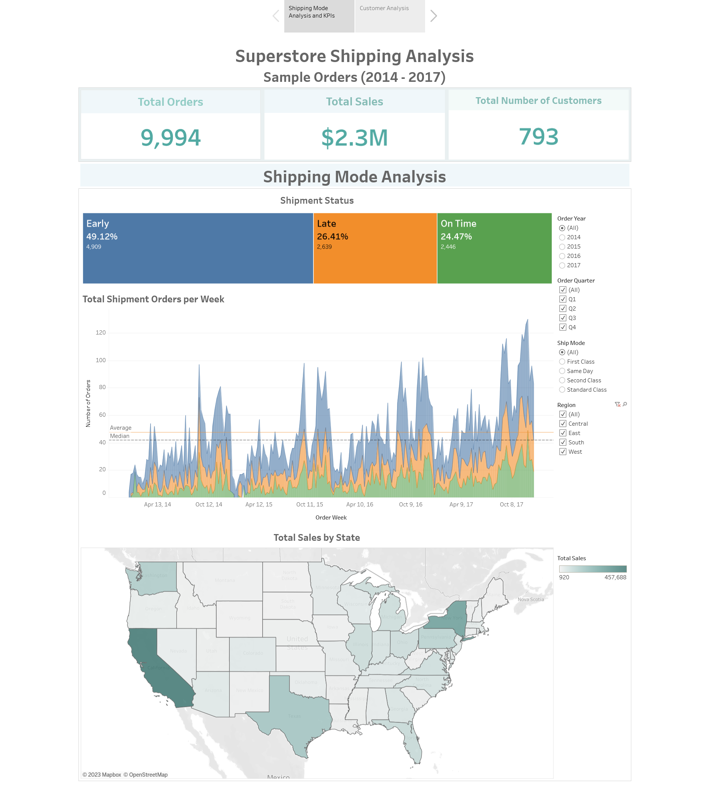
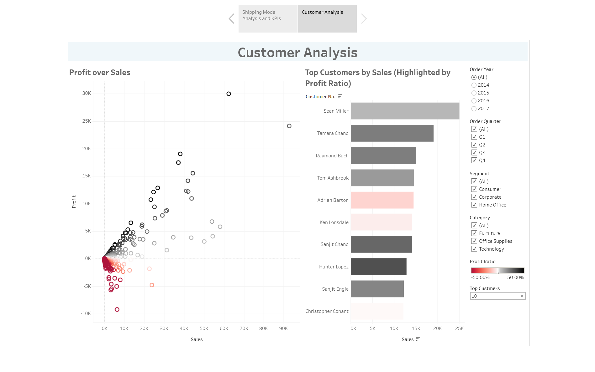

# Superstore Sales Analysis
## About the Data
This dataset contains the 2014 - 2017 order details, sales, and profit information for the Superstore Company. The Superstore Company sells and ships various products all over the continental US to consumer, corporate, and home office customers. The main categories of products are Furniture, Office Supplies, and Technology.
The data can be downloaded [here](https://s3-eu-west-1.amazonaws.com/course.oc-static.com/courses/5873606/sample_superstore_data+-+orders.csv)

You can view the report on [tableau public](https://public.tableau.com/app/profile/binyoh.langhe.theodore/viz/SuperstoreShippingAnalysis_16922722847360/Story1)

## Project Goal
This project places me in the role of a data analyst at the Superstore company, wherein a dashboard has been requested, which provideds insights divided into 2 main categories.

### 1. Shipping Mode Analysis
The management team in the shipping department wants to review the performance of the different ship modes that the company provides to its customers.
- They need to know how many orders are shipped **on-time**, **early**, and **late**.
- They also need a visual that displays the number of shipments over a year for each ship status (i.e., on-time, early, and late) with the ability to filter on the following dimensions: **Region**, **Ship Mode**, **Year** and **Quarter**.

### 2. Customer Analysis
- The sales team wants to review the company's profit over sales as well as a **ranking of the customers** (from greatest to least) based on their total sales amount.
- The team needs the visuals to highlight information about a customer's profit ratio and to allow them to input the number N for a filter of **top customers based on total amount of sales**.
- The team also needs to be able to filter on the following dimensions: **Year**, **Region**, **Segment**, **Category**, **Subcategory**.

Here are screenshots of the report:
##### Shipping Dashboard

##### Customer Dashboard
